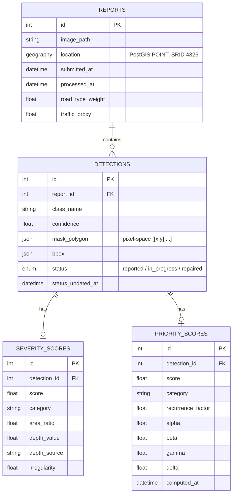

# Phase 5 / Task 1 — Database Schema

Implemented in [backend/app/models.py](../../backend/app/models.py) (SQLAlchemy 2.0 declarative models,
PostGIS via `geoalchemy2`).

## ER diagram

## Design notes

- **One report, many detections.** A citizen photo can contain more than one pothole; each gets its own row
  in `detections` rather than the report holding a single severity/priority value.
- **Repair status lives on `detections`, not `reports`.** A single photo could show one pothole already
  patched and another still open — status has to be per-pothole, not per-photo.
- **`severity_scores`/`priority_scores` are separate tables, 1:1 with `detections`**, mirroring the existing
  `src/severity/` and `src/prioritization/` module boundary — the API layer calls those modules and persists
  their output verbatim, it doesn't recompute anything.
- **`mask_polygon`/`bbox` are plain JSON in image-pixel space**, not PostGIS geometry — they describe where
  the pothole is *within the photo*, not a real-world geographic shape. `location` (the report's GPS point)
  is the actual geography column, using PostGIS so `GET /api/potholes` can do real proximity/region queries
  (`ST_DWithin`, etc.) instead of the haversine-in-Python loop `src/prioritization/traffic_recurrence.py`
  uses for the demo/ablation script — that becomes an optimization opportunity once report volume is real.
- **`alpha`/`beta`/`gamma`/`delta` are stored per priority-score row**, not just the resulting score — so
  changing the default weights later doesn't retroactively make historical priority scores look
  inconsistent; each row records exactly what weights produced it.
